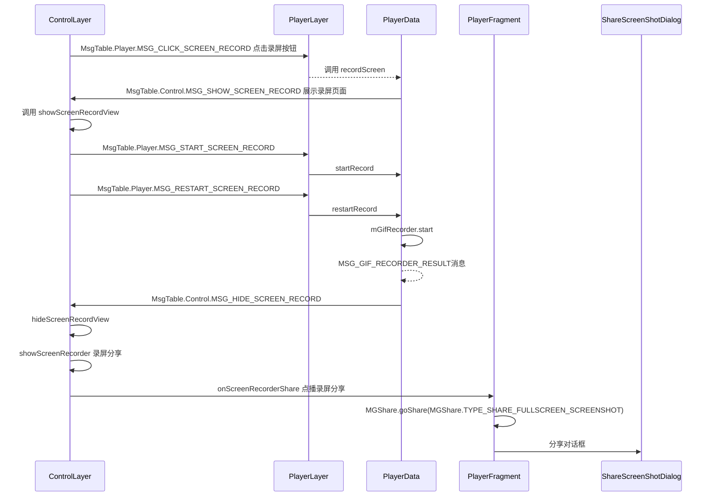

# 截屏录屏GiF需求

- 点播专用的播放器view : `ImgoPlayerView`
    - 业务封装
- 播放器 `IVideoView` -> `MgtvVideoView`
    - 播放组提供


点播页播放器层级关系：

- id/content (ContentFrameLayout)
  - SkinnableRelativeLayout
    - id/llPlayerContainer
      - id/flPlayerContainer
        - SkinnableRelativeLayout
          - id/flContainer (VerticalPageView)
            - ScreenOrientationContainer
              - FrameLayout --> `PlayerLayer`
                - `ImgoPlayerView` 业务播放view
                    - `MgtvVideoView` 播放View 
                    - `id/id_ai_ad_container`(FrameLayout)
                    - RelativeLayout   加载...
                    - TouPingView
              - FrameLayout --> `BarrageLayer`
                - `id/dv_vod_danmaku_view（MaskDanmakuView`） 弹幕
              - FrameLayout
                - `id/fl_ad_fragment_root` (FrameLayout)
              - FrameLayout  --> `ControlLayer`
                - RelativeLayout --> `layout_player_control.xml --> mControlView`
                  - id/rlControlExcBack
                  - id/ivBack
                  - id/llJustLook(LinearLayout)
                    - id/tvJustLookRemind  "正在试看，观看完整版请"
                    - id/tvJustLookBut(LinearLayout)
                      - SkinnableImageView
                      - id/tvJustLookBut(SkinnableTexView) "开通会员"

---

- PlayerFragment
    - mPlayerLayer
      - mImgoPlayer
    - mControlLayer
      - 截屏按钮

---



---

- `ControlLayer`
  - `layout_player_control.xml` --> mControlView
    - `mIvScreenRecorder` 录屏按钮 
    - `ivLockScreen` 锁屏按钮
  - ScreenRecordView

---

```java
// 设置无缝切换清晰度
switchVideoSource
```

```java
onScreenRecorderShare
TYPE_SHARE_FULLSCREEN_SCREENSHOT_V2
ShareScreenShotDialogV2
```